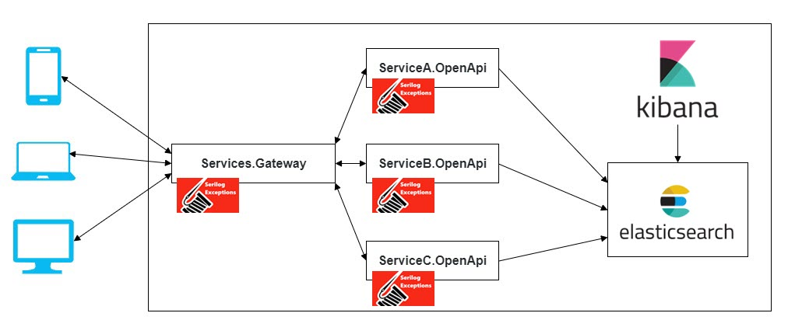
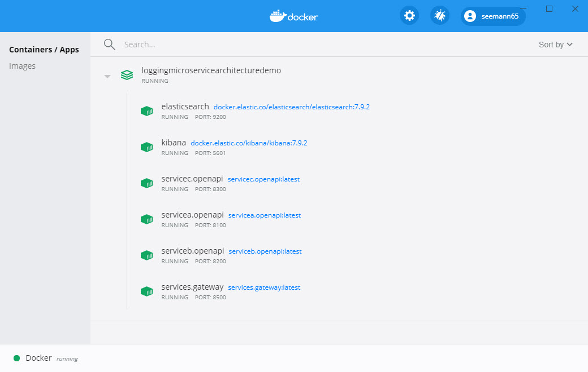
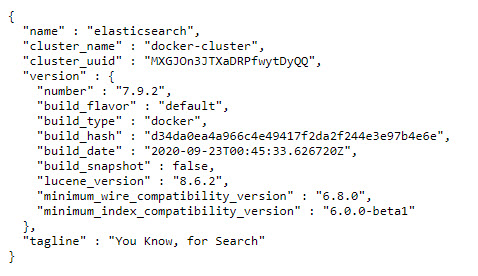
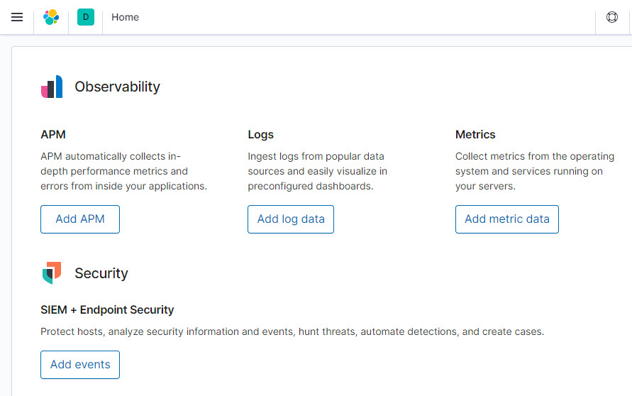
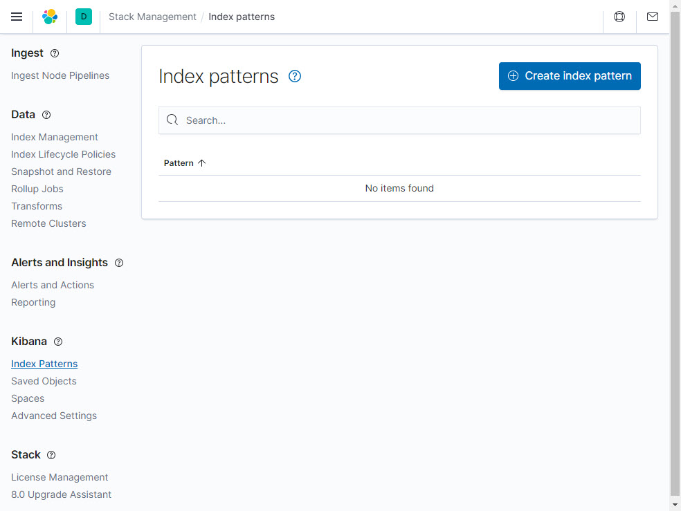
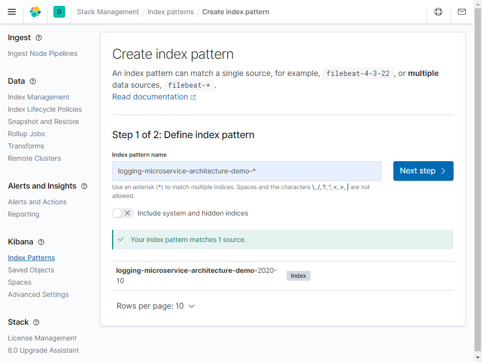
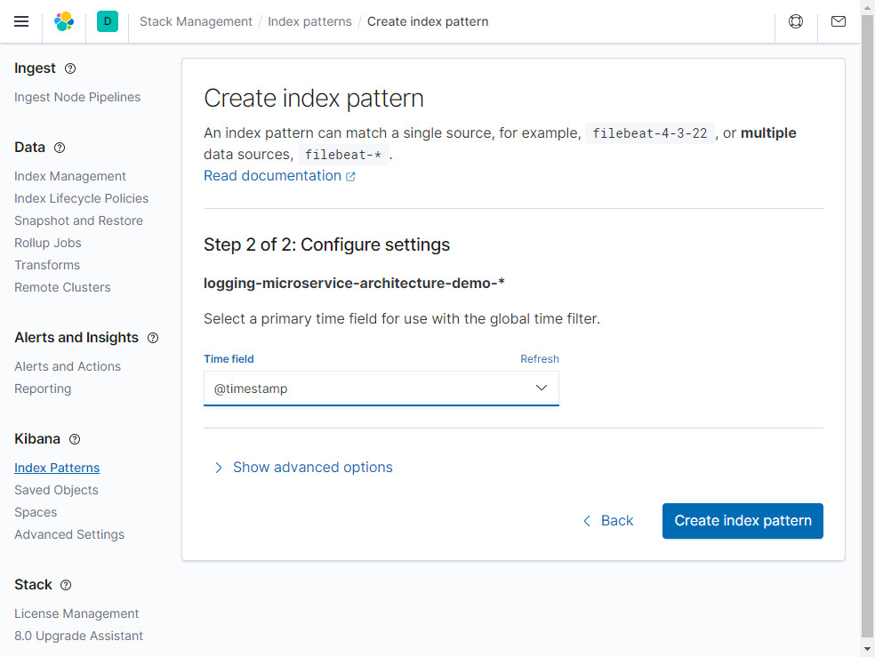
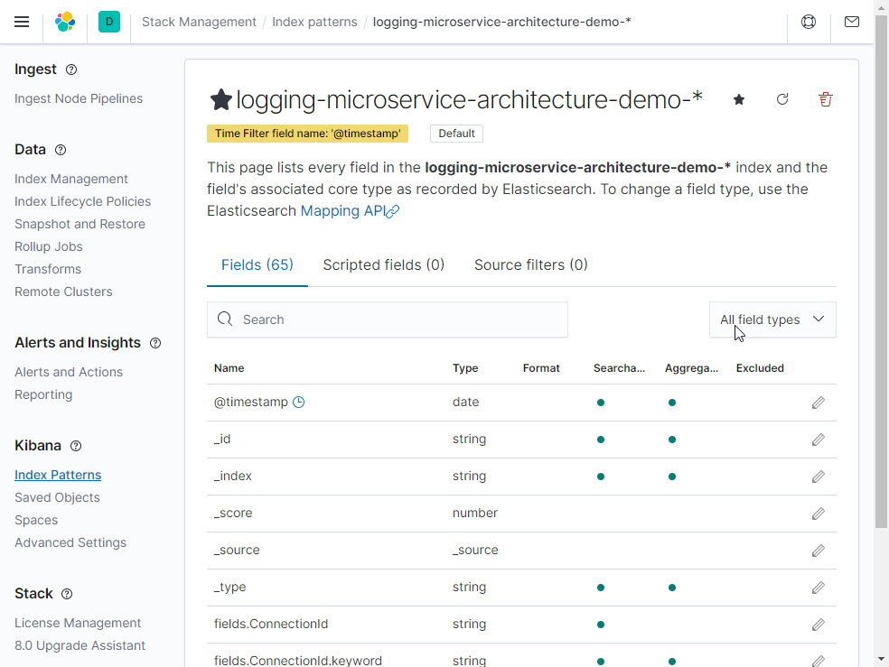
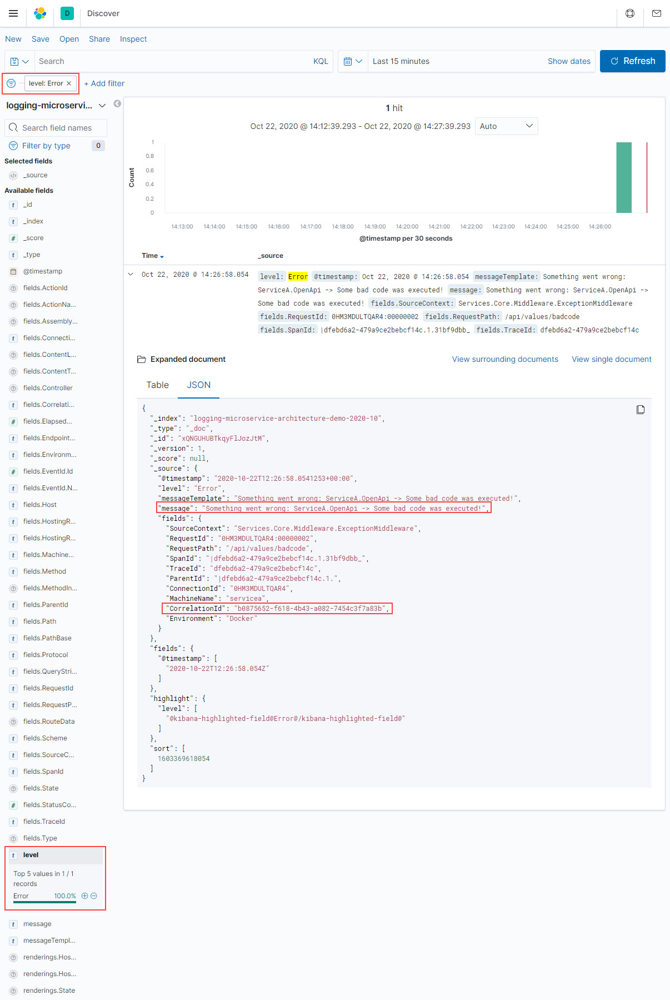

# Building logging system in Microservice Architecture (MSA)

A good and meaningful logging system in Microservices Architecture (MSA) is crucial for tracing failures. Because without it, our system will lost control. We would know that something is wrong or broken, but be unable to figure out exactly what, or at least not be able to do that without spending a lot of time searching for the problem. This wasted time can always be spent in better, more productive way. Do you agree?

## Introduction
In recent years, the rising of MSA makes logging becomes more important than ever. MSA offers us so many benefits like developing/deploying independently, easy to scale up and down, ability to use different technology stacks, etc. But using MSA can be quite difficult. Not only in how services communicate but also in how to manage them. And situation gets worse and complicated when one or more services fail. Although, we can know which service is failed by applying Health Check. But why does it fail? You can not find the answer if you don’t have good and meaningful logging system, a system that everyone can use and understand.

## Write logs that can tell stories
You need to be able to get back the whole story, namely there must be a way to connect together all related log entries. That is when Correlation ID comes into play. Imagine all log entries in a HTTP context, which starts from the presentation layer, down to the business layers, end up at the persistence layer, share a same correlation ID. When something went wrong, you can easily spot possible causes by viewing the whole picture. There are many ways to implement Correlation ID. In this demo, HttpContext is best the place to store Correlation ID. For cases where HttpContext does exist such as background threads you can use CallContext instead.


## Correlating logs
A Correlation ID is simply a unique identifier (GUID) that is passed through the entire request flow and crucially is passed between the services. When each service needs to log something, it can include this Correlation ID, thereby ensuring that we can track a full user request through from start to finish. We can parse all of the logs from each distinct part of the system, looking for the Correlation ID. We can then form a full picture of the lifetime of that request and hopefully identify root causes of any errors.
In order to receive as much information as possible, we need to generate a Correlation ID as close as possible to the start of activity, on the gateway or directly on the client (mobile or web).

## Let’s start
In this demo, I will show you how to build a correlating logging system in Microservices Architecture (MSA) with Serilog .NET Core, Elasticsearch and Kibana. But first, short introduction section (you can skip section below if you already know what they are).


## Serilog
[Serilog](https://serilog.net/) is a logging framework for .NET and it is built with powerful structured event data in mind. Writing logs using Serilog has never been easier with DSL, Enricher, Destructor. Furthermore, they provide more than 50 sinks to support writing log events to most of data storages popular these days in various ways. In this post, I will only use only some of them, but you can read more [here](https://serilog.net/).


## What is ElasticSearch?
[Elasticsearch](https://www.elastic.co/elasticsearch/) is an distributed, open source search and analytics engine for all types of data, including textual, numerical, geospatial, structured, and unstructured. Elasticsearch is built on Apache Lucene and was first released in 2010. Don’t think that Elasticsearch only fits with large data as it allows you to start small, but will grow together with your arhitecture. In this demo I will use Elasticsearch with single node cluster for local development.


## What is Kibana?
[Kibana](https://www.elastic.co/kibana) is a UI application that sits on top of [Elasticsearch](https://www.elastic.co/elasticsearch/). It provides search and visualization capabilities for data indexes in the ElasticSearch. Kibana’s core feature is data querying and analysis.

## Implementation
For implementation of Correlation ID I will use [Serilog.Enrichers.CorrelationId](https://github.com/ekmsystems/serilog-enrichers-correlation-id) Nuget Package which enriches Serilog events with a Correlation ID for tracking requests and [Serilog.Sinks.Elasticsearch](https://github.com/serilog/serilog-sinks-elasticsearch) which delivers the log data to Elasticsearch in a similar structure as Logstash and makes it easy to use Kibana for visualizing and analyzing.  
  
**Program.cs** for a **ServiceA.OpenApi** looks like this:
```csharp
using Microsoft.AspNetCore.Builder;
using Microsoft.AspNetCore.Hosting;
using Microsoft.Extensions.Configuration;
using Microsoft.Extensions.Hosting;
using Microsoft.Extensions.Logging;
using Serilog.Exceptions;
using Serilog.Sinks.Elasticsearch;
using Serilog;
using System.IO;
using System.Reflection;
using System;

namespace ServiceA.OpenApi
{
    public class Program
    {
        public static void Main(string[] args)
        {
            CreateHost(args);
        }

        private static void CreateHost(string[] args)
        {
            try
            {
                CreateHostBuilder(args).Build().Run();
            }
            catch (Exception ex)
            {
                Log.Fatal($"Failed to start {Assembly.GetExecutingAssembly().GetName().Name}", ex);
                throw;
            }
        }

        public static IHostBuilder CreateHostBuilder(string[] args) =>
            Host.CreateDefaultBuilder(args)
                .ConfigureWebHostDefaults(webBuilder =>
                {
                    webBuilder.UseContentRoot(Directory.GetCurrentDirectory());
                    webBuilder.UseSerilog((hostingContext, config) => config
                        .Enrich.FromLogContext()
                        .Enrich.WithExceptionDetails()
                        .Enrich.WithMachineName()
                        .Enrich.WithCorrelationId()
                        .Enrich.WithProperty("Environment", Environment.GetEnvironmentVariable("ASPNETCORE_ENVIRONMENT"))
                        .WriteTo.Console()
                        .WriteTo.Elasticsearch(ConfigureElasticSearchSink())
                        .ReadFrom.Configuration(hostingContext.Configuration));
                    webBuilder.UseStartup<Startup>();
                })
                .ConfigureAppConfiguration((hostingContext, config) =>
                {
                    config
                        .SetBasePath(hostingContext.HostingEnvironment.ContentRootPath)
                        .AddJsonFile("appsettings.json", optional: false, reloadOnChange: true)
                        .AddJsonFile($"appsettings.{hostingContext.HostingEnvironment.EnvironmentName}.json", optional: true)
                        .AddEnvironmentVariables();
                })
                .ConfigureLogging((builderContext, logging) =>
                {
                    logging.ClearProviders();
                    logging.AddConsole();
                    logging.AddSerilog();
                });

        private static ElasticsearchSinkOptions ConfigureElasticSearchSink()
        {
            var configuration = new ConfigurationBuilder()
                .AddJsonFile("appsettings.json", optional: false, reloadOnChange: true)
                .AddJsonFile($"appsettings.{Environment.GetEnvironmentVariable("ASPNETCORE_ENVIRONMENT")}.json", optional: true)
                .Build();
            var elasticUri = new Uri(configuration["ElasticConfiguration:Uri"]);
            return new ElasticsearchSinkOptions(elasticUri)
            {
                AutoRegisterTemplate = true,
                IndexFormat = $"logging-microservice-architecture-demo-{DateTime.UtcNow:yyyy-MM}"
            };
        }
    }
}

```

We also have to register the **IHttpContextAccessor** singleton (with **AddHttpContextAccessor**) so that the enricher has access to the requests HttpContext so that it can attach the correlation ID to the request/response.

```csharp
using Microsoft.AspNetCore.Builder;
using Microsoft.AspNetCore.Hosting;
using Microsoft.AspNetCore.Http;
using Microsoft.Extensions.Configuration;
using Microsoft.Extensions.DependencyInjection;
using Microsoft.Extensions.Hosting;
using Microsoft.Extensions.Logging;
using Services.Core.Middleware;
using System.Reflection;

namespace ServiceA.OpenApi
{
    public class Startup
    {
        private readonly string _service_name;

        public Startup(IConfiguration configuration)
        {
            _service_name = Assembly.GetExecutingAssembly().GetName().Name;
            Configuration = configuration;
        }

        public IConfiguration Configuration { get; }

        public void ConfigureServices(IServiceCollection services)
        {
            services.AddControllers();
            services.AddCors();
            services.AddHttpContextAccessor();
            services.AddRouting(options => options.LowercaseUrls = true);
        }

        public void Configure(IApplicationBuilder app, IWebHostEnvironment env, ILogger<Startup> logger)
        {
            if (env.IsDevelopment())
            {
                app.UseDeveloperExceptionPage();
            }
            else
            {
                app.UseHsts();
            }
            
            app.UseMiddleware<ExceptionMiddleware>();
            
            app.UseRouting();
            app.UseStaticFiles();

            app.UseEndpoints(endpoints =>
            {
                endpoints.MapControllers();
                endpoints.MapGet("/", async context =>
                {
                    await context.Response.WriteAsync(_service_name);
                });
            });
        }
    }
}

```
## Configuration
For a local development **appsettings.Development.json** configuration looks like this:
```json
{
  "Serilog": {
    "MinimumLevel": {
      "Default": "Information",
      "Override": {
        "Microsoft": "Information",
        "System": "Warning"
      }
    }
  },
  "ElasticConfiguration": {
    "Uri": "http://localhost:9200"
  }
}

```
For a **Docker** deployment we have to replace in **appsettings.Docker.json** localhost with **elasticsearch** host name:
```json
{
  "Serilog": {
    "MinimumLevel": {
      "Default": "Information",
      "Override": {
        "Microsoft": "Information",
        "System": "Warning"
      }
    }
  },
  "ElasticConfiguration": {
    "Uri": "http://elasticsearch:9200"
  }
}
```

## Architecture


Achitecture is pretty simple, it consists from a gateway and three OpenAPI services:
* **Services.Gateway**: Gateway to all APIs
* **ServiceA.OpenApi**: Simple OpenAPI REST service
* **ServiceB.OpenApi**: Simple OpenAPI REST service
* **ServiceC.OpenApi**: Simple OpenAPI REST service

Each service has only one controller with equal endpoints like this:
```csharp
using Microsoft.AspNetCore.Mvc;
using Microsoft.Extensions.Logging;
using System;
using System.Reflection;

namespace ServiceA.OpenApi.Controllers
{
    [ApiController]
    [Route("api/[controller]")]
    public class ValuesController : ControllerBase
    {
        private readonly string _service_name;
        private readonly ILogger<ValuesController> _logger;

        public ValuesController(ILogger<ValuesController> logger)
        {
            _service_name = Assembly.GetExecutingAssembly().GetName().Name;
            _logger = logger;
        }

        [HttpGet("badcode")]
        public string BadCode()
        {
            var msg = $"{_service_name} -> Some bad code was executed!";
            throw new Exception(msg);
        }

        [HttpGet]
        public IActionResult Get()
        {
            var msg= $"{_service_name} -> Value";
            _logger.LogInformation(msg);
            return Ok(msg);
        }

        [HttpGet("healthcheck")]
        public IActionResult Healthcheck()
        {
            var msg = $"{_service_name} is healthy";
            _logger.LogInformation(msg);
            return Ok(msg);
        }

        [HttpGet("status")]
        public IActionResult Status()
        {
            var msg = $"{_service_name}, running on {Request.Host}";
            _logger.LogInformation(msg);
            return Ok(msg);
        }
    }
}
```
** **NOTICE**: Exceptions are captured globally with **ExceptionMiddleware** which is part of **Services.Core** common library.

# Run the Solution

## Compose containers in Docker

**Docker-compose.yml** file with setup for all the containers looks like this:
```yml
version: '3.6'

services:
    # Elasticsearch Docker Images: https://www.docker.elastic.co/
    elasticsearch:
        container_name: elasticsearch
        image: docker.elastic.co/elasticsearch/elasticsearch:7.9.2
        restart: on-failure
        hostname: elasticsearch
        networks:
            - common_network

    kibana:
        container_name: kibana
        image: docker.elastic.co/kibana/kibana:7.9.2
        restart: on-failure
        hostname: kibana
        networks:
            - common_network
  
    servicea.openapi:
        container_name: servicea.openapi
        image: servicea.openapi:latest
        restart: on-failure
        hostname: servicea.openapi
        build:
            context: .
            dockerfile: src/ServiceA.OpenApi/Dockerfile
        networks:
            - common_network

    serviceb.openapi:
        container_name: serviceb.openapi
        image: serviceb.openapi:latest
        restart: on-failure
        hostname: serviceb.openapi
        build:
            context: .
            dockerfile: src/ServiceB.OpenApi/Dockerfile
        networks:
            - common_network

    servicec.openapi:
        container_name: servicec.openapi
        image: servicec.openapi:latest
        restart: on-failure
        hostname: servicec.openapi
        build:
            context: .
            dockerfile: src/ServiceC.OpenApi/Dockerfile
        networks:
            - common_network

    services.gateway:
        container_name: services.gateway
        image: services.gateway:latest
        restart: on-failure
        hostname: services.gateway
        build:
            context: .
            dockerfile: src/Services.Gateway/Dockerfile
        networks:
            - common_network

networks:
    common_network:
        driver: bridge
```
and **Docker-compose.override.yml** file:
```yml
version: '3.6'

services:
    elasticsearch:
        environment:
            - discovery.type=single-node
            - xpack.monitoring.enabled=true
            - xpack.security.enabled=false
            - xpack.watcher.enabled=false
            - "ES_JAVA_OPTS=-Xms512m -Xmx512m"
        ports:
            - 9200:9200
        volumes:
            - elasticsearch-data:/usr/share/elasticsearch/data

    kibana:
        environment:
            - ELASTICSEARCH_URL=http://elasticsearch:9200
            - ELASTICSEARCH_HOSTS=http://elasticsearch:9200
        ports:
            - 5601:5601
        depends_on:
            - elasticsearch

    servicea.openapi:
        environment:
            - ASPNETCORE_ENVIRONMENT=Docker
            - ASPNETCORE_URLS=http://+:80
        ports:
            - 8100:80
        volumes:
            - ${APPDATA}/Microsoft/UserSecrets:/root/.microsoft/usersecrets:ro
            - ${APPDATA}/ASP.NET/Https:/root/.aspnet/https:ro
        depends_on:
            - elasticsearch

    serviceb.openapi:
        environment:
            - ASPNETCORE_ENVIRONMENT=Docker
            - ASPNETCORE_URLS=http://+:80
        ports:
            - 8200:80
        volumes:
            - ${APPDATA}/Microsoft/UserSecrets:/root/.microsoft/usersecrets:ro
            - ${APPDATA}/ASP.NET/Https:/root/.aspnet/https:ro
        depends_on:
            - elasticsearch

    servicec.openapi:
        environment:
            - ASPNETCORE_ENVIRONMENT=Docker
            - ASPNETCORE_URLS=http://+:80
        ports:
            - 8300:80
        volumes:
            - ${APPDATA}/Microsoft/UserSecrets:/root/.microsoft/usersecrets:ro
            - ${APPDATA}/ASP.NET/Https:/root/.aspnet/https:ro
        depends_on:
            - elasticsearch

    services.gateway:
        environment:
            - ASPNETCORE_ENVIRONMENT=Docker
            - ASPNETCORE_URLS=http://+:80
        ports:
            - 8500:80
        volumes:
            - ${APPDATA}/Microsoft/UserSecrets:/root/.microsoft/usersecrets:ro
            - ${APPDATA}/ASP.NET/Https:/root/.aspnet/https:ro
        depends_on:
            - servicea.openapi
            - serviceb.openapi
            - servicec.openapi

volumes:
    elasticsearch-data:
        driver: local
```

To execute compose file, open Powershell, and navigate to the compose file in the root folder. Then execute the following command: **docker-compose up -d --build**. The -d parameter executes the command detached. This means that the containers run in the background and don’t block your Powershell window. To check all running Containers use **docker ps**.  
** **NOTE: Please wait a minute or two to Elasticsearch and Kibana start up!**



## Verify that Elasticsearch is up and running
Navigate to http://localhost:9200



## Verify that Kibana is up and running
Navigate to http://localhost:5601



## Logging events
Log some **events** navigating to http://localhost:8500/servicea/api/values, or to any other service.

## Logging exceptions
For a throwing exceptions, each controller has a GET method **BadCode**
```csharp
[HttpGet("badcode")]
public string BadCode()
{
    var msg = $"{_service_name} -> Some bad code was executed!";
    throw new Exception(msg);
}
```
Above code is self explanatory. Now, let's test the method by navigating to http://localhost:8500/servicea/api/values/badcode, or to any other service. An error log event should be delivered to Elasticsearch index.

## Launching Kibana
Since we configured logging in the startup class and set the minimum log level to Information, running the application would have logged a few events to ElasticSearch. Let's open up [Kibana](https://www.elastic.co/kibana) at http://localhost:5601 so that we can view the logs. Once Kibana loads, you'll be presented with the default page.

#### Create an Index Pattern
Kibana won't show any logs just yet. You have to specify an index before you can view the logged data. To do this, click on the Explore on my own link on the default Kibana page, and then click the Discover link in the navigation.


Then, type in an index pattern. It will show the index pattern that was just created. You can type in the entire index, or use wildcards as shown below.


On the next page, select the **@timestamp** field as the time filter field name and click the Create index pattern button.


Index Pattern is sucessfuly created


#### Searching for Errors in Kibana
You can view the logs by clicking the Discover link in the navigation pane. Now filter the index by **level: Error**. And as you can see, error log information is very well structured and contains all necessary informations.

Errors are now being logged in a structured way. For instance, the exception message is being logged in a fields.Exception. Message field, which means that this field is now searchable and indexable.

## Turning Down Log Level Verbosity
You'll probably find the information level logs for a little bit too verbose. By default, ASP.NET Core will log hosting related events for Microsoft Kestrel server. This can get quite noisy. A simple way to exclude hosting related event is to adjust the appsettings file by setting the Microsoft log level to Warning. Optionally you could restrict logging even further by setting the minimum log level to Error for Default and System as shown below.
```csharp
"Serilog": {
  "MinimumLevel": {
    "Default": "Error",
    "Override": {
      "Microsoft": "Error",
      "System": "Error"
    }
  }
}
```

## Clear Elasticsearch indexes
** **NOTE**: Whenever you want to start the demo from scratch you have to delete all **logging-microservice-architecture-demo-*** indexes by executing Powershell command: **Invoke-WebRequest -method DELETE http://localhost:9200/_all**

## Conclusion
When you think about all the convenience and functionality you get by combining Docker, ElasticSearch, Kibana, ASP.NET Core and Serilog, there's really no excuse to not incorporate correlation logging into MSA anymore. Do you agree? Enjoy!

## Prerequisites
- [Visual Studio](https://www.visualstudio.com/vs/community) 2019 16.8.4 or greater
- [.NET SDK 5.0.202](https://dotnet.microsoft.com/download/dotnet/5.0)
- [Docker](https://www.docker.com/resources/what-container)  

## Tags & Technologies
- [.NET 5.0.5](https://github.com/dotnet/core/blob/main/release-notes/5.0/5.0.5/5.0.5.md)
- [Docker](https://www.docker.com/resources/what-container)  
- [Elasticsearch](https://www.elastic.co/elasticsearch/)
- [Kibana](https://www.elastic.co/kibana)
- [Serilog](https://serilog.net/)
- [Ocelot](https://github.com/ThreeMammals/Ocelot)  

## Licence
Licenced under [MIT](http://opensource.org/licenses/mit-license.php).
Contact me on [LinkedIn](https://si.linkedin.com/in/matjazbravc).
